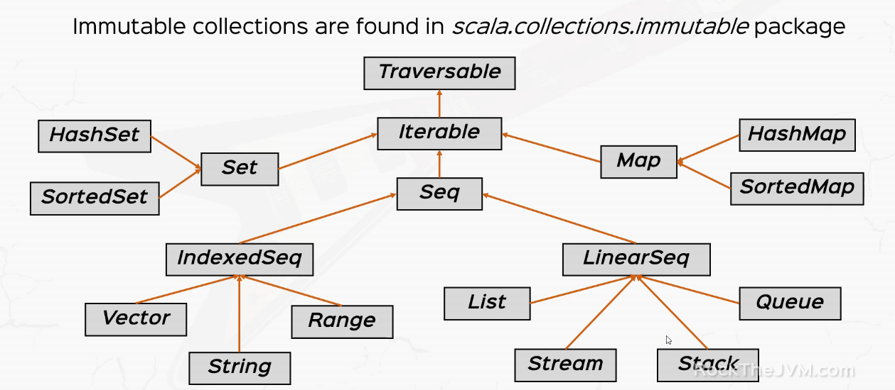
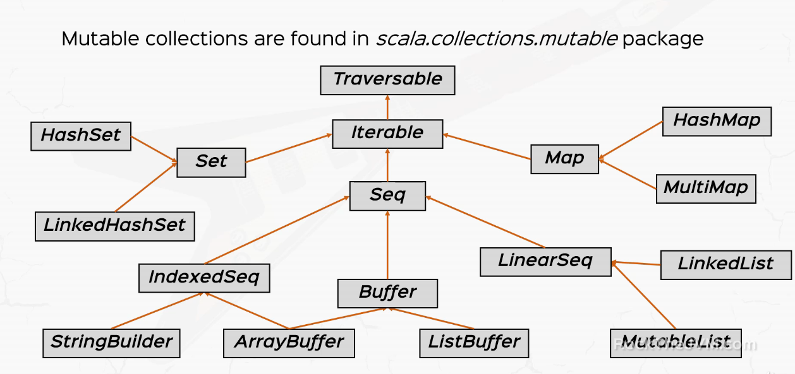

# Collections overview

* Scala offers both mutable and immutable collections

```scala
import scala.collections.immutable
import scala.collections.mutable
```

* Default `List`, `Set` and `Map` that we use are all immutable collections.

## Immutable collections



* `Vector`, `String` and `Range` - elements can be accessed in constant time.

## Mutable Collections



## `Traversable` trait

This base trait offers the following methods

* `map`, `flatMap`, `collect`
* `toArray`, `toList`, `toSeq`
* `isEmpty`, `size`, `nonEmpty`
* `exists`, `forall`
* `foldLeft`, `foldRight`, `reduceLeft`, `reduceRight`
* `head`, `find`, `tail`
* `mkString`

---

## References

* [Scala & Functional Programming for Beginners | Rock the JVM](https://www.udemy.com/share/1013xsCUMfd1lVR34=/)
