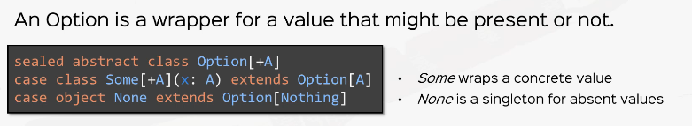

# Options

* Option can either hold a single value of some type or no value at all.
* This helps handle absence of a value (particularly when we are planning to reutrn `null`).



```Scala
val firstOption: Option[Int] = Some(3)
val noOption: Option[Int]  = None
```

* **Never do this**. `Some(null)` or `Some(something_that_returns_null)`.

* With `Options` we don't have to do null check at all.

```Scala
def unsafeAPI(): String = null

val result = Option(unsafeAPI())

// Chainging methods
def backupMethod(): String = "Default Value"
val chainedResult = Option(unsafeAPI()).orElse(Option(backupMethod()))

// better design
def betterUnsafeAPI(): Option[String] = None
def betterBackupMethod(): Option[String] = Some("Default Value")
val betterChainedResult = betterUnsafeAPI() orElse betterBackupMethod()
```

## Functions on `Option`

The most idiomatic way to use an $option instance is to treat it as a collection or monad and use `map`,`flatMap`, `filter`, or `foreach`.

```Scala
val firstOption: Option[Int] = Some(4)
println(firstOption.isEmpty)

// This is not a recommended method to call on Option
// println(firstOption.get)
// Because None.get throws NoSuchElementException
// But we can use getOrElse
println(firstOption.getOrElse)

// map, filter and flatMap
println(firstOption.map(_ * 10))
println(firstOption.filter(x => x > 10))
println(firstOption.flatMap(x => Option(x * 10)))
```

## Official Documentation

```Scala
val name: Option[String] = request getParameter "name"
val upper = name map { _.trim } filter { _.length != 0 } map { _.toUpperCase }
println(upper getOrElse "")

// Note that this is equivalent to

val upper = for {
    name <- request getParameter "name"
    trimmed <- Some(name.trim)
    upper <- Some(trimmed.toUpperCase) if trimmed.length != 0
} yield upper
println(upper getOrElse "")
```

Because of how for comprehension works, if `None` is returned from `request.getParameter`, the entire expression results in `None`

These are useful methods that exist for both `Some` and `None`.

* `isDefined` — True if not empty
* `isEmpty` — True if empty
* `nonEmpty` — True if not empty
* `orElse` — Evaluate and return alternate optional value if empty
* `getOrElse` — Evaluate and return alternate value if empty
* `get` — **Return value, throw exception if empty**
* `fold` —  Apply function on optional value, return default if empty
* `map` — Apply a function on the optional value
* `flatMap` — Same as map but function must return an optional value
* `foreach` — Apply a procedure on option value
* `collect` — Apply partial pattern match on optional value
* `filter` — An optional value satisfies predicate
* `filterNot` — An optional value doesn't satisfy predicate
* `exists` — Apply predicate on optional value, or false if empty
* `forall` — Apply predicate on optional value, or true if empty
* `contains` — Checks if value equals optional value, or false if empty
* `toList` — Unary list of optional value, otherwise the empty list

A **less-idiomatic way** to use `Option` values is via pattern matching.

```Scala
val nameMaybe = request getParameter "name"
nameMaybe match {
    case Some(name) =>
        println(name.trim.toUppercase)
    case None =>
        println("No name value")
}
```

Interacting with code that can occasionally return `null` can be safely wrapped in `Option` to become `None` and `Some` otherwise.

```Scala
val abc = new java.util.HashMap[Int, String]
abc.put(1, "A")
val bMaybe = Option(abc.get(2))
bMaybe match {
    case Some(b) =>
        println(s"Found $b")
    case None =>
        println("Not found")
}
```

## Example

```Scala
val config: Map[String, String] = Map(
    // fetched from elsewhere
    "host" -> "176.45.36.1",
    "port" -> "80"
)

class Connection {
    def connect = "Connected" // connect to some server
}

object Connection {
    val random = new Random(System.nanoTime())

    def apply(host: String, port: String): Option[Connection] =
        if (random.nextBoolean()) Some(new Connection)
        else None
}

// try to establish a connection, if so - print the connect method
val host = config.get("host")
val port = config.get("port")
/*
if (h != null)
    if (p != null)
    return Connection.apply(h, p)
return null
*/
val connection = host.flatMap(h => port.flatMap(p => Connection.apply(h, p)))
/*
if (c != null)
    return c.connect
return null
*/
val connectionStatus = connection.map(c => c.connect)
 println(connectionStatus)
/*
if (status != null)
    println(status)
*/
connectionStatus.foreach(println)
```

* Above solution written concisely

```Scala
 // chained calls
//  The chain breaks when any of the Option is None
config.get("host").
flatMap(host => config.get("port").
                flatMap(port => Connection(host, port)).
                map(connection => connection.connect)).
foreach(println)

// for-comprehensions
// If any of host or port or connection is None,
// the for comprehension yields None
val forConnectionStatus = for {
    host <- config.get("host")
    port <- config.get("port")
    connection <- Connection(host, port)
} yield connection.connect

forConnectionStatus.foreach(println)
```

---

## References

* [Scala & Functional Programming for Beginners | Rock the JVM](https://www.udemy.com/share/1013xsCUMfd1lVR34=/)
